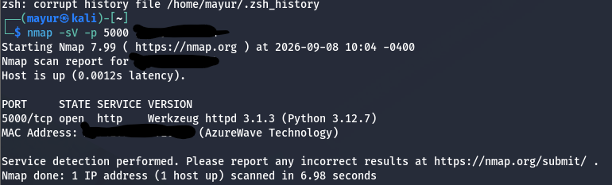
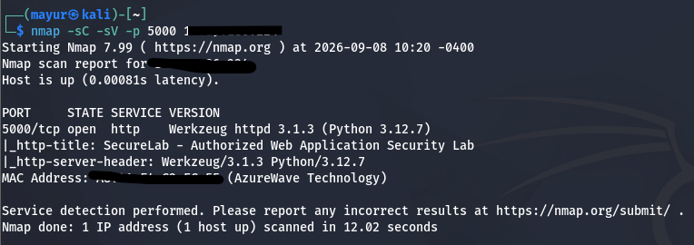
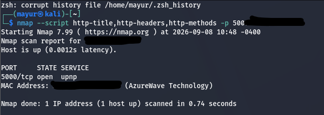
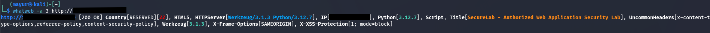
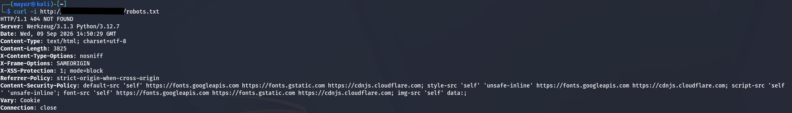
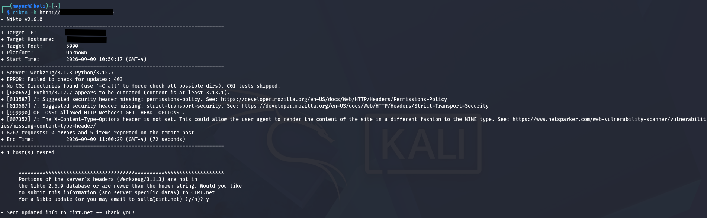

#  Reconnaissance

Reconnaissance is the initial information-gathering phase of the SecureLab web application penetration test.

The following activities were performed against the authorized SecureLab lab environment.

## Target

```text
Application : SecureLab
Platform    : Flask / Python
Protocol    : HTTP
Port        : 5000
Tester      : Kali Linux
```

## Tools

- Nmap
- WhatWeb
- cURL
- Nikto

---

## 1. Target Application


---

## 2. Nmap

### Basic Port Scan

```bash
nmap <TARGET-IP>
```



### Service and Version Detection

```bash
nmap -sC -sV <TARGET-IP>
```



### HTTP Enumeration

```bash
nmap -p 5000 --script http-title,http-headers,http-methods <TARGET-IP>
```



---

## 3. WhatWeb

Technology fingerprinting was performed against the web application.

```bash
whatweb http://<TARGET-IP>:5000
```



---

## 4. cURL

The `robots.txt` resource was inspected using cURL.

```bash
curl http://<TARGET-IP>:5000/robots.txt
```



> `robots.txt` is not an access-control mechanism. Discovered paths require further validation.

---

## 5. Nikto

An initial web-server assessment was performed using Nikto.

```bash
nikto -h http://<TARGET-IP>:5000
```



> Nikto results are indicators that require manual verification.

---

## Evidence Structure

```text
reconnaissance/
├── curl/
│   └── robots.png
├── Nikto/
│   └── nikto.png
├── nmap/
│   ├── basic-scan.png
│   ├── default-scripts.png
│   └── http-enumeration.png
├── whatweb/
│   └── whatweb.png
├── website.png
└── README.md
```

All screenshots above are the recorded evidence for the reconnaissance activities.
