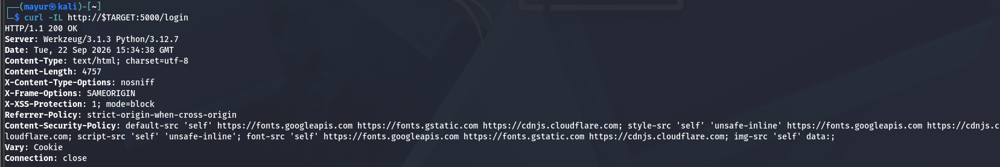
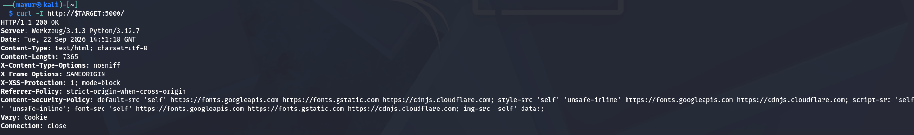
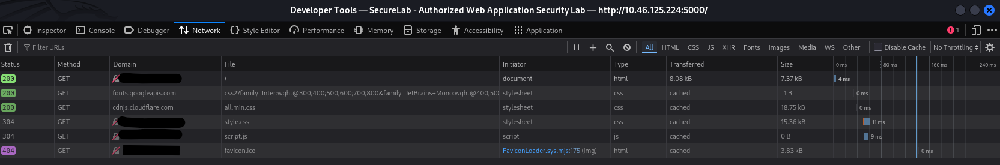
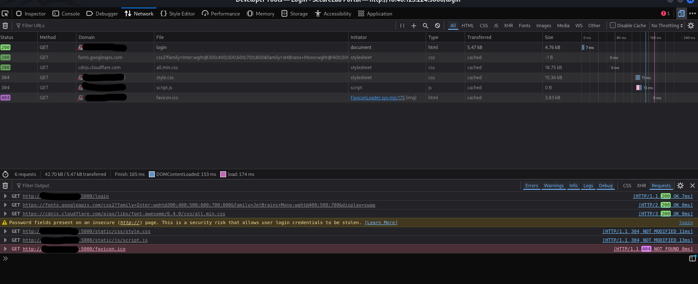

# Web Application Testing

Manual HTTP and browser-based security analysis of the authorized SecureLab web application.

## HTTP Analysis

### cURL

Performed:

- HTTP response analysis
- Login endpoint analysis
- Request and response inspection
- GET request analysis

Key observations:

- HTTP response status was inspected
- Response headers were analyzed
- Application response behavior was examined
- Login endpoint response was reviewed

### Browser DevTools

Firefox Developer Tools were used to analyze:

- Network requests
- HTTP methods and status codes
- Request and response headers
- Application pages
- Browser-side behavior

## Evidence

### cURL Login Analysis

### cURL Response Analysis

### Browser Homepage Analysis

### Browser Network Analysis

## Assessment Notes

The SecureLab application is an authorized local Flask testing environment. Observations identified during HTTP and browser analysis are treated as testing evidence and are manually verified before being reported as vulnerabilities.

## Status

- cURL HTTP analysis
- Login endpoint analysis
- Browser Network analysis
- Request/response analysis
- Browser-based application analysis
